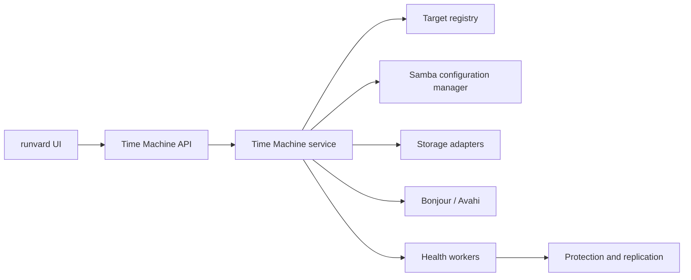

# Time Machine Integration Design

## Status

Accepted and implemented on 2026-08-01. The implementation includes managed
Samba and Avahi configuration, directory/ZFS/Btrfs targets, native quotas where
supported, storage protection points, retention, local native or rsync
replication, constrained remote rsync replication, atomic passive generations,
split-brain-safe promotion/import, durable jobs, alert-channel integration,
managed-config drift reconciliation, API, responsive Backups UI and bounded
acceptance/load tools.

Target creation now fails closed unless Samba, its complete configuration,
Apple AAPL compatibility, Avahi and the persistent maintenance timer are ready.
Generated shares require SMB encryption and restrict clients to loopback,
private, link-local and unique-local network ranges. Maintenance records actual
target allocation and automatically quarantines a target if its mount, mount
identity or target directory disappears, removing its Samba and Bonjour
advertisement. Account and storage provisioning, received-replica import and
Btrfs promotion all have explicit rollback paths.

Interrupted replication jobs are recovered from the durable journal on worker
startup, with a three-interruption retry ceiling. Local and remote incomplete
staging generations are cleaned only inside their managed namespaces. Job
history and maintenance-timer readiness are visible in the Time Machine UI.
Client-side encryption acknowledgement is enforced by both target creation and
received-replica import APIs and recorded as target policy metadata.

The Linux and browser suites are automated. Real-Mac backup, Apple verification,
file restore and Migration Assistant exercises remain external release gates;
use [the acceptance runbook](../TIME_MACHINE_ACCEPTANCE.md). They must not be
reported as passed until run on the supported macOS versions and test hardware.
The runbook also contains a read-only Linux host gate for the installed Samba,
Avahi, encrypted access, cross-user isolation and maintenance timer.

## Objective

Turn a runvard host into a managed SMB Time Machine destination for up to 20
Macs. macOS remains responsible for backup scheduling, versioning, client-side
encryption, integrity verification, and restoration. runvard is responsible for
the network destination, identities, capacity controls, storage protection,
replication, health monitoring, and guided setup.

## Understanding

- Support up to 20 registered Macs and 10 concurrent backup connections.
- Authenticate by person. One person may own multiple separately managed Mac
  targets and changing that person's SMB password affects all assigned Macs.
- Give every Mac a separate share, storage path, and capacity limit.
- Work on an existing writable mount by default; add native quotas, snapshots,
  and replication when ZFS or Btrfs is available.
- Permit access only on a trusted LAN or through an existing VPN. SMB must never
  be exposed directly to the public internet.
- Manage Samba, Avahi, validation, reload, and recovery from runvard without
  silently changing manually maintained shares.
- Add server-side storage protection and local or remote replication while
  keeping restores inside Apple's supported Time Machine and Migration
  Assistant workflows.

## Assumptions

- The managed host is a supported Debian- or Ubuntu-based Linux system.
- An administrator has selected and mounted the intended backup storage before
  creating a directory-backed target.
- Remote replication uses an already trusted VPN or SSH path.
- Time Machine controls its own schedule and internal retention.
- Client-side backup encryption is mandatory policy but cannot be conclusively
  enforced or verified by a server without a Mac-side agent.
- Administrators remain responsible for periodic restore exercises.
- Throughput depends on the storage pool and network. runvard keeps its API
  responsive under the target concurrency but cannot guarantee a transfer rate.

## Explicit Non-Goals

- AFP support.
- Guest or anonymous Time Machine access.
- Publishing SMB directly to the internet.
- Installing a runvard agent on each Mac.
- Browsing or extracting Time Machine backup contents in runvard.
- Claiming that observed server activity proves a successful macOS backup.
- Restoring individual files or a whole Mac from the runvard UI.
- Turning ZFS or Btrfs snapshots into user-visible Time Machine versions.

## Existing Context

runvard already installs host Samba, manages Samba passwords, exposes generic
share APIs, and manages storage. The current generic share implementation
appends directly to `/etc/samba/smb.conf` and restarts `smbd`; that path is not
safe enough for Time Machine. Avahi is not currently an explicit full-install
dependency, and the existing in-process background-job registry is not durable
across application restarts.

The integration therefore receives its own module and lifecycle instead of
adding a `time_machine` flag to generic Samba shares.

## Selected Architecture

Use the existing host Samba service and manage Time Machine through a dedicated
runvard module. The module owns a generated include file such as
`/etc/samba/runvard-timemachine.conf`; it does not append target blocks directly
to the main configuration.

### Rejected alternatives

1. **Extend generic shares.** Rejected because ordinary file sharing and
   security-sensitive backup destinations have different lifecycle, quota,
   monitoring, and deletion semantics.
2. **Run a Samba container or second instance.** Rejected because host Samba
   already owns port 445. A second service would require another address or
   network interface and would complicate identities, permissions, discovery,
   and firewall management.

## Components

### Target registry

The registry under `/opt/runvard/data` is the runvard source of truth. Writes
must be locked and atomic. It stores no plaintext password and no recoverable
SMB secret.

Each target records at least:

- stable ID, display name, and unique share name;
- owner account and optional Mac label;
- canonical path and expected mount identity;
- requested capacity and effective quota mode;
- storage backend and protection policy;
- enablement, provisioning, and health state;
- last observed activity, snapshot, and replication records.

### Identity manager

The default identity is a backup-only local account per person, without an
interactive login shell. An administrator may instead select an existing Samba
account. A person may access all Mac targets assigned to that account; this is
a person-level, not device-level, security boundary.

Passwords are passed directly to `smbpasswd`, can be generated for one-time
display, and must never appear in registry, list APIs, audit messages, or logs.

### Samba configuration manager

For every change, the manager:

1. renders a complete temporary include from registry state;
2. validates the complete Samba configuration with `testparm`;
3. backs up and atomically replaces the managed include;
4. reloads Samba without unnecessarily terminating active sessions;
5. verifies service health and restores the previous include on failure;
6. commits the new target state only after successful activation.

Each target is a dedicated share containing no unrelated files. Its effective
configuration requires an authenticated writable share, `vfs_fruit` with the
required companion modules, `fruit:time machine = yes`, and no guest access.
SMB transport encryption is required per Time Machine share with
`server smb encrypt = required`; runvard must not globally raise Samba's minimum
protocol and thereby change unrelated shares.

Samba negotiates Apple's AAPL extensions on the first tree connection. The
preflight must therefore inspect all existing `vfs objects` definitions and
report configurations that could disable AAPL for Mac clients. Exact fruit
options are selected against the installed Samba version and verified in
integration tests rather than assumed from one distribution release.

### Discovery manager

Prefer Samba's own mDNS registration when the installed build supports it.
Otherwise manage one explicit Avahi advertisement. Never publish duplicate
records. Bonjour is the convenience path for a local subnet; VPN setup uses a
documented direct `smb://host/share` connection because multicast discovery is
not assumed to cross routed VPNs.

### Storage adapters

| Backend | Per-Mac resource | Enforcement | Managed protection |
|---|---|---|---|
| ZFS | dataset | native hard quota | native snapshots and send/receive |
| Btrfs | subvolume | qgroup hard limit | native snapshots and send/receive |
| Other mounted filesystem | dedicated directory | reported limit only in the first release | none in the first release |

`fruit:time machine max size` is only a client-facing size hint. Samba documents
its calculation as approximate, so it must never be treated as enforcement.
For native backends, the advertised size must be lower than the real hard limit
so metadata and operational headroom cannot cause an abrupt server-side quota
failure before macOS can prune old backups. The concrete reserve is determined
during implementation and compatibility testing.

The setup assistant asks for the Mac's source capacity and recommends a target
of at least twice that size. Directory-backed targets visibly state that their
limit is not hard-enforced. ext4 and XFS project quotas are deferred until their
mount-option and migration behavior can be supported safely.

Capacity and retention remain editable after provisioning. A ZFS/Btrfs change
updates the native quota and the lower Samba-advertised size as one operation;
if Samba/Avahi activation or state persistence fails, runvard restores the old
managed configuration and native quota. Directory targets update only the
reported limit because they have no hard quota.

Before reducing capacity, runvard measures allocated bytes on the target's
mounted filesystem. The change is rejected when allocated data exceeds the new
advertised capacity, and fails closed if usage cannot be measured. This keeps
the five-percent operational reserve intact instead of creating an immediately
full destination.

### Storage protection points

The UI calls ZFS and Btrfs snapshots **storage protection points**, never Time
Machine snapshots or verified restore points. The initial default retention is:

- seven daily protection points;
- four weekly protection points;
- three monthly protection points.

Creation should prefer a target with no open backup-bundle files, not merely no
SMB session. A filesystem snapshot is crash-consistent storage protection, not
an Apple integrity result. After promoting or restoring one, macOS must verify
the network backup.

Protection points consume physical pool capacity outside the size reported to
macOS. At 85 percent pool use runvard warns. At 95 percent it pauses new
protection points and replication jobs but does not intentionally terminate an
active Time Machine backup. Retention pruning must never delete the current
backup target.

### Replication

Use the strongest compatible data path:

- ZFS to ZFS: incremental `zfs send/receive`;
- Btrfs to Btrfs: incremental `btrfs send/receive`;
- heterogeneous or directory targets: `rsync` from an idle source or available
  storage protection point.

Local replication can target a second pool. Remote replication can target a
connected runvard server over VPN/SSH. Federation may provide peer selection
and capability information, but bulk data uses a dedicated transport. Remote
SSH credentials are restricted to a runvard receiver and do not grant a free
shell.

Only one replication runs per source pool and per destination. Schedules,
windows, and bandwidth limits are configurable; the initial default is one
daily off-hours run. Each run has a durable journal and never deletes source
data or the last complete destination state after a failed transfer.

Replication schedule, bandwidth, and enabled state remain editable. Disabling
a replication cancels its queued jobs. Removing a Mac target disables its
dependent replications and cancels their queued jobs; removal is rejected while
one of those replications is running.

Replicas remain passive and non-writable. Promotion requires an explicit
failover workflow:

1. confirm that the previous source can no longer accept writes;
2. select the last complete replicated state;
3. recreate the expected account, share, encryption, and quota policy;
4. explicitly promote and advertise the replica;
5. run Apple's network-backup verification from the Mac.

This prevents two writable copies of one network backup.

## Target Lifecycle

### Create

1. Check Samba version, fruit modules, AAPL compatibility, Avahi, network,
   target mount identity, writable space, and quota capability.
2. Select or create the person's backup-only identity.
3. Create the directory, dataset, or subvolume and set restrictive ownership.
4. Apply the native quota when available and calculate the advertised limit.
5. Generate and validate the complete managed Samba include.
6. Atomically activate configuration and discovery.
7. Commit the registry state and present the Mac setup guide.

If provisioning fails, restore configuration and state. A newly created empty
resource may be removed; an existing or non-empty path must never be deleted by
rollback.

### Disable, remove, and delete

- **Pause** stops advertisement and new target use while preserving definition
  and data.
- **Remove target** deletes runvard and Samba configuration but preserves all
  backup data.
- **Delete backup data** is a separate destructive action with an exact target
  summary and elevated confirmation.

A missing expected mount never causes runvard to recreate its path on the root
filesystem. The target becomes critical and is no longer advertised.

## User Experience

Time Machine is a dedicated tab under **Backups**. Generated shares may be
listed under **Shares** but are read-only there and link back to their owning
target.

The setup wizard covers:

1. host prerequisites;
2. person or backup-account selection;
3. Mac name, storage location, and source capacity;
4. target capacity, protection, and replication policies;
5. password entry or one-time generation;
6. configuration preview and activation;
7. LAN Bonjour or VPN SMB connection steps;
8. mandatory selection of encrypted backup on macOS;
9. warning that losing the client encryption password loses access to backups.

A target starts in **Waiting for first Mac** and changes to **Active** after
observed connection and bundle activity. runvard does not inspect backed-up
files. Overview cards show owner, share, hard or reported limit, usage, active
access, last observed backup activity, storage protection age, replication age,
and health.

## API Surface

The intended resource groups are:

- `GET /api/time-machine/system` for prerequisites and service health;
- target list, detail, creation, update, pause, and removal under
  `/api/time-machine/targets`, including `POST .../targets/policy`;
- manual storage-protection operations under
  `/api/time-machine/protection-points`;
- destination, job, status, identity and promotion operations under
  `/api/time-machine/replications`, including `POST .../replications/policy`;
- `GET /api/time-machine/events` for the bounded Time Machine change journal;
- `GET /api/time-machine/setup-guide` for context-specific Mac instructions.

Read operations require an authenticated runvard session. Every mutation
requires confirmed administrator authority and an audit entry. Destructive data
deletion uses the existing danger-confirmation model with a dedicated action
scope. Long operations return durable job IDs rather than waiting for completion
inside an HTTP request.

Policy updates and target removal additionally write a bounded 200-entry
Time Machine journal containing the authenticated actor, affected IDs, time,
and old/new policy values. The journal never stores passwords, encryption
secrets, private keys, or confirmation tokens.

## Durable Jobs and Health

Scheduled health, protection, and replication work runs through systemd workers
or another host-persistent runner, not runvard's in-memory thread registry. Job
state and journals survive web-process and host restarts.

Target states are **Waiting**, **Active**, **Warning**, **Critical**, **Paused**,
and **Provisioning**. Checks include:

- Samba, Avahi, config validation, and managed-config drift;
- mount identity, write access, quota, pool use, and free capacity;
- last observed activity and open backup handles;
- overdue protection and replication work;
- remote destination reachability and capacity.

Existing in-app, email, and webhook alert channels are reused. Repeated alerts
are deduplicated with cooldowns, and delivery failures are recorded. Managed
configuration drift is displayed with a controlled reconciliation action and
is never silently overwritten.

## Security Model

- No guest access and no public SMB exposure.
- Per-share SMB transport encryption is required.
- Client-side Time Machine encryption is mandatory policy and must be confirmed
  during setup; runvard cannot prove it without a Mac agent.
- A network account protects share access; the separate Time Machine encryption
  password protects backup content even from storage administrators who do not
  know that password.
- Canonical-path checks, symlink defenses, strict name validation, and
  argument-list subprocess calls prevent path escape and command injection.
- Passwords and private SSH material are excluded from API responses, audits,
  diagnostics, and ordinary logs.
- Remote replication receivers expose only the constrained operations required
  for capability checks and data receipt.

## Important Failure Cases

- **Mount missing:** stop advertisement; never create a replacement directory.
- **Pool nearly full:** warn, then pause new protection and replication work.
- **Samba validation or reload fails:** restore the previous include and leave
  registry state unchanged.
- **User missing:** fail closed; never fall back to guest access.
- **Remote destination unavailable:** retain source and last complete replica,
  retry according to policy, and alert after threshold.
- **Replication interrupted:** resume only where the backend can prove a safe
  continuation; otherwise restart from the last complete base.
- **Managed config edited externally:** report drift and require controlled
  reconciliation.
- **Unencrypted Mac setup:** policy remains unconfirmed; warn that enabling
  encryption later on a network destination creates a new encrypted backup set.

## Verification Strategy

### Unit tests

- registry atomicity and recovery;
- share, account, and canonical-path validation;
- Samba rendering, diffing, and rollback state machine;
- capacity calculations and hard-versus-reported quota states;
- retention, alert deduplication, job recovery, and replica promotion rules;
- prevention of password and secret disclosure.

### Linux integration tests

- `testparm` against the generated complete configuration;
- authenticated `smbclient` access and cross-user denial;
- per-share SMB encryption and guest rejection;
- fruit module availability and Bonjour discovery;
- ZFS and Btrfs quota, protection, pruning, and native replication;
- directory and heterogeneous replication fallback;
- restart and fault injection for workers, Samba, mounts, and destinations.

### Mac acceptance tests

1. Discover locally through Bonjour and connect through a direct VPN SMB URL.
2. Select the destination with client-side encryption enabled.
3. Complete an initial and an incremental backup.
4. Reconnect automatically after Mac and server restarts.
5. Exercise quota and capacity warnings.
6. Verify the network backup from macOS.
7. Replicate, safely promote a test copy, and verify it from macOS.
8. Restore a file and perform a Migration Assistant test using Apple tools.

Support targets SMB-based Time Machine from macOS 11 onward. Release testing
covers the oldest supported version where practical and the current supported
macOS versions. A load test simulates ten concurrent SMB writers while checking
that runvard's API remains responsive. Initial backups should be staggered and
wired networking recommended where available.

## Decision Log

1. Build the full NAS-oriented feature rather than a simple share toggle.
2. Design for 20 registered Macs and 10 concurrent backups.
3. Authenticate by person, with multiple separate Mac targets per account.
4. Apply a separate capacity limit to every Mac target.
5. Use existing mounts with optional native ZFS/Btrfs management.
6. Permit trusted LAN and existing VPN access, never public SMB.
7. Let runvard install and manage required host components.
8. Treat encrypted Time Machine backups as mandatory policy.
9. Keep Mac onboarding agentless and guided.
10. Keep restore operations in Apple's supported tools.
11. Support local-pool and remote-runvard replication.
12. Use host Samba with a dedicated runvard-managed include.
13. Separate registry, Samba, storage, discovery, and health components.
14. Use backup-only person accounts by default and transactional provisioning.
15. Give ZFS/Btrfs native quotas and snapshots; expose weaker directory limits.
16. Prefer native incremental replication and serialize it by pool/destination.
17. Put the feature under Backups with confirmed-admin mutations.
18. Use durable system workers and existing alert channels.
19. Require real-Mac acceptance and network-backup verification.
20. Require SMB transport encryption per target, not a global protocol change.
21. Audit all existing shares for fruit/AAPL compatibility.
22. Treat Samba's reported maximum size as a hint, not enforcement.
23. Name server snapshots storage protection points and avoid integrity claims.
24. Keep remote replicas passive until an explicit split-brain-safe promotion.

## Primary References

- [Apple: Back up your Mac with Time Machine](https://support.apple.com/en-us/104984)
- [Apple: Back up to a shared folder](https://support.apple.com/de-de/guide/mac-help/mchl31533145/26/mac/26)
- [Apple: Time Machine local snapshots](https://support.apple.com/en-lamr/102154)
- [Apple: Secure a Time Machine backup disk](https://support.apple.com/en-lamr/guide/mac-help/mh21241/mac)
- [Apple: Verify a network backup](https://support.apple.com/en-gb/guide/mac-help/mh26840/mac)
- [Apple: Restore from a backup](https://support.apple.com/en-euro/102551)
- [Samba: vfs_fruit](https://www.samba.org/samba/docs/current/man-html/vfs_fruit.8.html)
- [Samba: smb.conf and per-share SMB encryption](https://www.samba.org/samba/docs/4.18/man-html/smb.conf.5.html)
